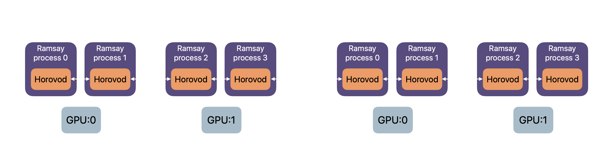

.. _simulation_distributed:

Fast distributed simulations
============================
``pfl`` simulations are fast when set up correctly.
This chapter provides help for making sure you are using ``pfl`` in the most optimal way.
``pfl`` supports distributed training, supporting multi-machine, multi-GPU, and multi-process training.
Which setup is most efficient depends on what hardware is available, your use case and choice of hyperparameters.
The training of users in a cohort is sharded across the allocated machines, GPUs and processes.
Central evaluation can also be sharded.
The figure below visualizes how ``pfl`` can distribute work for federated learning simulations.

``pfl`` has support for distributed simulations using native ``tf.distribute`` and ``torch.distributed`` primitives.

Quickstart
----------

Assume ``train.py`` implements PFL training by calling ``FederatedAlgorithm.run``.
To run on 2 GPUs on the same machine using native distributed libraries, do this:

.. code-block::

    export PFL_WORKER_ADDRESSES=localhost:8000,localhost:8001
    PFL_WORKER_RANK=0 python train.py &
    PFL_WORKER_RANK=1 python train.py &

    
Notice how we don't need to change the Python code at all to enable distributed simulation.
It is all configured by how you call the script to run simulation, and ``pfl`` will automatically adjust.

.. _multi-GPU_training:

Multi-GPU training
^^^^^^^^^^^^^^^^^^

``pfl`` supports distributed training with multiple GPUs using native TensorFlow and PyTorch distributed primitives.
This section assumes the GPUs are located on a single machine, but you can scale up even further with multiple machines, see `multi-machine_training`_.
Single-machine multi-GPU training is favourable if your GPU resources can fit onto 1 machine (at most 8 GPUs on common cloud machines) because it avoids network communication.

**PyTorch models**: Use ``torchrun`` to launch multi-GPU training:

.. code-block::

  torchrun --standalone --nnodes=1 --nproc_per_node=8 train.py

The above will run the script ``train.py`` with 8 processes on localhost. If you have 8 GPUs on the machine, ``pfl`` will use 1 GPU for each process.

**TensorFlow models**: Set environment variables and launch multiple processes:

.. code-block::

  export PFL_WORKER_ADDRESSES=localhost:8000,localhost:8001,localhost:8002,localhost:8003,localhost:8004,localhost:8005,localhost:8006,localhost:8007
  for i in {0..7}; do PFL_WORKER_RANK=$i python train.py & done

``pfl`` is built such that when running multiple processes, training local users will automatically be distributed across the processes.

.. _multi_process_training:

Multi-process training
^^^^^^^^^^^^^^^^^^^^^^

.. warning::

  To run multi-process training, you need to allow multiple processes to allocate memory on GPU at the same time.
  This can be done by switching the GPU's compute mode to "Default" using command:

  .. code-block::

    nvidia-smi -c 0

  If you only want to change this for certain GPUs, use the ``-i`` flag to specify which GPU.

``pfl`` supports training local models of users in multiple processes while sharing a GPU.
This is compatible with both multi-machine mode and multi-GPU mode.
If either your model is small, or you have small datasets per user, the GPU utilization can be smaller because of the overhead that federated learning causes.
Using multiple processes for each GPU can thereby bring additional speedups.
For PyTorch models, you can specify more processes than GPUs using the ``--nproc_per_node`` flag in ``torchrun``.
If the machine has 8 GPUs and you use ``torchrun --standalone --nnodes=1 --nproc_per_node=32 train.py``, then there will be 32 processes with an instance each running ``pfl``, split among the 8 GPUs, i.e. 4 processes sharing each GPU.

Also, keep in mind that the CPU cores available on your machine will also be shared with the parallelization of preparing user data if :class:`~pfl.data.tensorflow.TFFederatedDataset` or :class:`~pfl.data.pytorch.PyTorchFederatedDataset` is used.
When adding the multi-process to your training setup, first try 1, 2, 3, ..., processes per GPU and stop once you don't see any noticable speedups.
You can use :class:`~pfl.callback.stopwatch.StopwatchCallback` to measure the speed of the simulation.
The optimal number of processes per GPU can vary between 1-5, since single-process ``pfl`` already has high GPU utilization.
The larger the cohort size, the smaller the models are and the smaller the user datasets are, the more you can benefit from increasing the number of processes.

.. _multi-machine_training:

Multi-machine training
^^^^^^^^^^^^^^^^^^^^^^

``pfl`` supports distributed training with multiple machines across the network.
This allows for scaling up simulations to an arbitrary number of GPUs.
Since the distributed computation is training individual users, the limit of scaling up is a function of your cohort size and the time it takes to train a local model.
Speedup from scaling up the official benchmarks availabe in ``pfl-research`` usually tapers off at 5-20 GPUs.

**PyTorch models**: Use ``torchrun`` on each machine. For example, with 2 machines at IPs ``192.168.1.2`` and ``192.168.1.3``, each with 8 GPUs:

.. code-block::

   # On machine 192.168.1.2 (node 0):
   torchrun --nnodes=2 --nproc_per_node=16 --node_rank=0 \
     --master_addr=192.168.1.2 --master_port=29500 train.py

   # On machine 192.168.1.3 (node 1):
   torchrun --nnodes=2 --nproc_per_node=16 --node_rank=1 \
     --master_addr=192.168.1.2 --master_port=29500 train.py

The above command will run multi-worker, multi-GPU, multi-process simulations with 16 processes per machine, where each GPU is shared among 2 processes.

**TensorFlow models**: Set ``PFL_WORKER_ADDRESSES`` and ``PFL_WORKER_RANK`` on each machine, as shown in the section below.

Distributed simulation with native TF/PyTorch libraries
-------------------------------------------------------

The concept is the same whether using PyTorch or TensorFlow.
For PyTorch models, you can use ``torchrun`` (recommended) as shown in the sections above, or use environment variables.
For TensorFlow models and NumPy models, you must use environment variables.

There are two environment variables to let ``pfl`` know that you intend to run simulation in distributed mode:

* ``PFL_WORKER_ADDRESSES`` - A comma separated list of ``host:port`` for all workers to run.
* ``PFL_WORKER_RANK`` - The rank of the current process.

If you intend to run multiple processes on same machine (multi-GPU and multi-process training), the training script need to be called once for each process to start, and each process should be assigned a unique order in ``PFL_WORKER_RANK``.

.. code-block::

    export PFL_WORKER_ADDRESSES=localhost:8000,localhost:8001
    PFL_WORKER_RANK=0 python train.py &
    PFL_WORKER_RANK=1 python train.py &

Multi-GPU training
^^^^^^^^^^^^^^^^^^

To run on multiple GPUs on a single machine, the addresses will all be ``localhost`` with unique ports.
This is how to train 1 process per GPU on 2 GPUs on 1 machine:

.. code-block::

    export PFL_WORKER_ADDRESSES=localhost:8000,localhost:8001
    PFL_WORKER_RANK=0 python train.py &
    PFL_WORKER_RANK=1 python train.py &

**Note**: PyTorch users should prefer using ``torchrun`` as described in the section above.

Multi-process training
^^^^^^^^^^^^^^^^^^^^^^

To run on multiple processes sharing a GPU on a single machine, command will be the same as in previous section, but you can specify more processes than there are GPUs on the machine.
This is how to train 2 processes on each GPU, using 2 GPUs on 1 machine:

.. code-block::

    export PFL_WORKER_ADDRESSES=localhost:8000,localhost:8001,localhost:8002,localhost:8003
    PFL_WORKER_RANK=0 python train.py &
    PFL_WORKER_RANK=1 python train.py &
    PFL_WORKER_RANK=2 python train.py &
    PFL_WORKER_RANK=3 python train.py &

The result is that if there are ``n`` GPUs, then process ``i`` will have shared access to GPU number ``i % n``.
The number of processes that can share a GPU and result in speedup depends on the amount of non-GPU overhead the FL setup has, which is use-case specific.
The optimal number of processes to share a GPU is usually in the range ``[1,5]``.

**Note**: PyTorch users should prefer using ``torchrun`` as described in the section above.

Multi-machine training
^^^^^^^^^^^^^^^^^^^^^^

Multiple machines can be utilized in distributed simulation by simply specifying the public addresses of the machines in the command.
This is how to train 2 processes on each machine, using 2 machines:

.. code-block::

    # Executed locally on machine 1 (IP 192.168.0.2)
    export PFL_WORKER_ADDRESSES=192.168.0.2:8000,192.168.0.2:8001,192.168.0.3:8000,192.168.0.3:8001
    PFL_WORKER_RANK=0 python train.py &
    PFL_WORKER_RANK=1 python train.py &

    # Executed locally on machine 2 (IP 192.168.0.3)
    export PFL_WORKER_ADDRESSES=192.168.0.2:8000,192.168.0.2:8001,192.168.0.3:8000,192.168.0.3:8001
    PFL_WORKER_RANK=2 python train.py &
    PFL_WORKER_RANK=3 python train.py &

**Note**: PyTorch users should prefer using ``torchrun`` as described in the section above.

NumPy-based models
^^^^^^^^^^^^^^^^^^

When using NumPy-based models (e.g., GBDT models), you must specify which distributed backend to use via the ``PFL_NUMPY_DISTRIBUTE_METHOD`` environment variable.
Valid values are ``tensorflow`` or ``pytorch``.
This tells ``pfl`` whether to use TensorFlow's or PyTorch's distributed communication primitives under the hood.

.. code-block::

    # Use PyTorch distributed backend for NumPy models
    export PFL_NUMPY_DISTRIBUTE_METHOD=pytorch
    export PFL_WORKER_ADDRESSES=localhost:8000,localhost:8001
    PFL_WORKER_RANK=0 python train.py &
    PFL_WORKER_RANK=1 python train.py &

If you choose ``pytorch`` as the backend, you can also use ``torchrun`` instead of environment variables.

Central evaluation
------------------

Central evaluation (:class:`~pfl.callback.central_evaluation.CentralEvaluationCallback`) is often essential for assessing the global model performance.
There are three things to keep in mind to minimise compute time for central evaluation:

* Performing this evaluation is usually not necessary every central iteration.
  ``evaluation_frequency`` allows you to run central evaluation at a lower frequency than every central iteration.
* In federated learning, a small local batch size is commonly used for training. You can set a larger batch size in the evaluation :class:`~pfl.hyperparam.base.ModelHyperParams` which can significantly speed up evaluation.
* In distributed simulations, ``pfl`` can shard the evaluation among available GPUs.

.. image:: ../images/distributed-sim-eval-duration.png

The left panel of the figure above show the seconds per central iteration for the `LM example`_ before increasing ``local_batch_size`` and enabling sharded central evaluation.
The right panel show the same metric when following the above guidelines.

Native datasets
---------------

``pfl`` supports both its own dataset structure for representing users, :class:`~pfl.data.dataset.Dataset`, as well as ``tf.data.Dataset`` using :class:`~pfl.data.tensorflow.TFFederatedDataset` and ``torch.utils.data.Dataset`` using :class:`~pfl.data.pytorch.PyTorchFederatedDataset`.

If all data can fit into RAM, then using :class:`~pfl.data.dataset.Dataset` is the fastest.
If you need to load the data from disk in a lazy fashion, or if you do heavy preprocessing, then we recommend using :class:`~pfl.data.tensorflow.TFFederatedDataset` and :class:`~pfl.data.pytorch.PyTorchFederatedDataset` respectively to allow for parallelization of preparing users' data.

.. _LM example: https://github.com/apple/pfl-research/tree/main/benchmarks/lm
